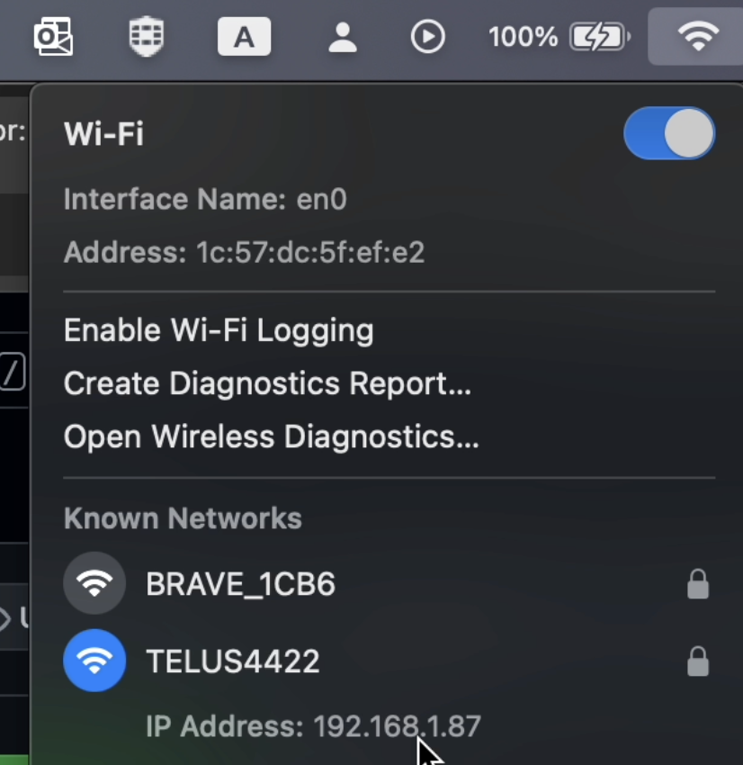
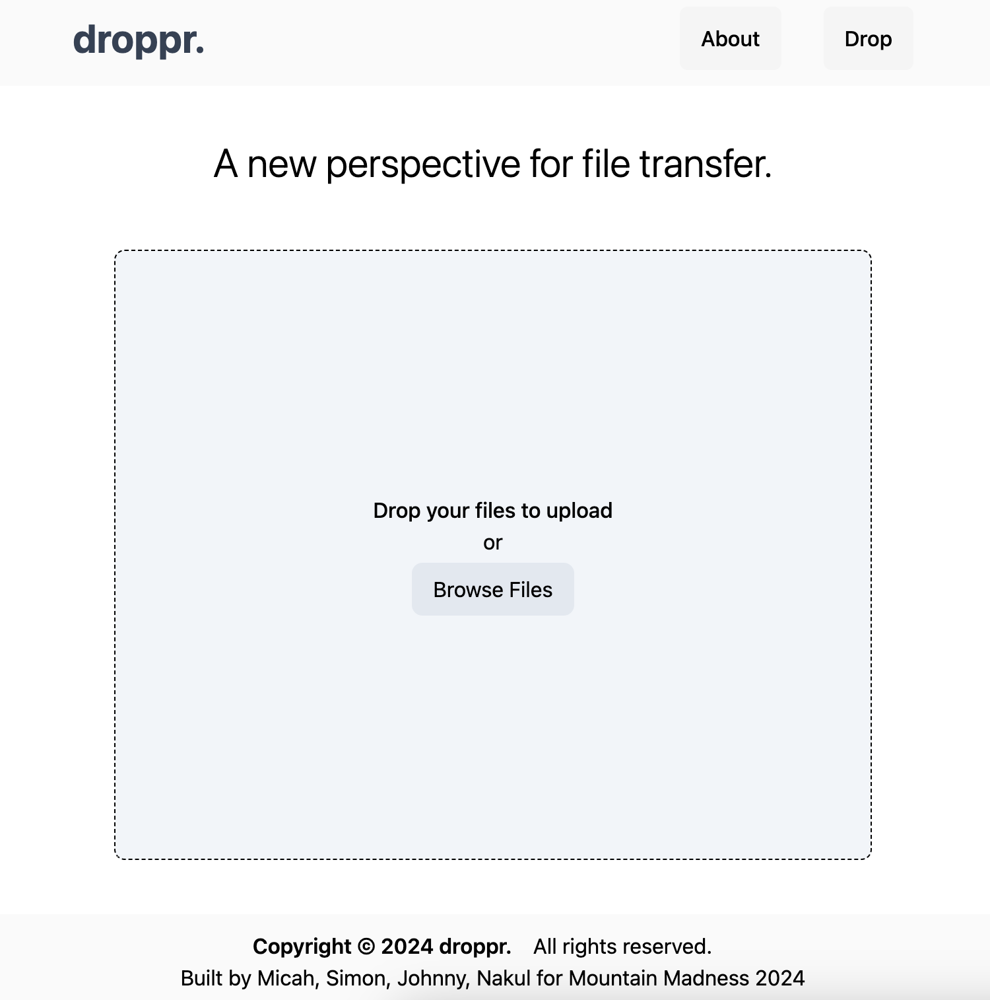
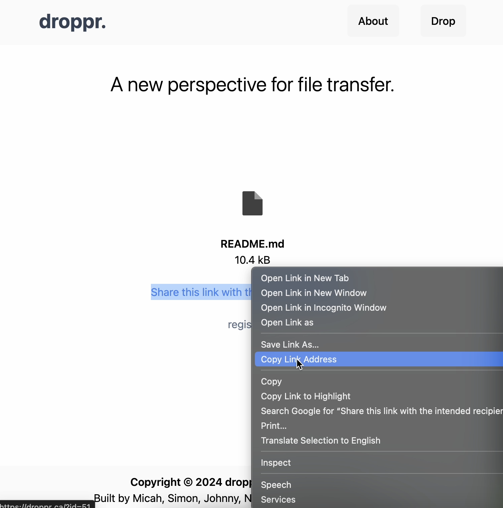

# Droppr.

Droppr is a novel file transfer app / website / program created by Micah Baker, Nakul Bansal, Johnny Deng, and Simon Purdon for the Mountain Madness 2024 Hackathon on the Simon Fraser University Burnaby Mountain campus.

## Prompt: A New Perspective

**A new perspective on file transfer.**

Droppr does something that no other transfer websites do: remove the middle-man during data transfer.

This is a *new perspective* to the conventional "cloud storage" model of file transfer, as droppr transfers files in peer-to-peer fashion, without losing security, and retaining file quality.

With droppr, why use the cloud? 🤔
We hope that by using droppr you'll get a new perspective on file transfer, and rethink the benefits of transfer convention.

## IMPORTANT DISCLAIMER

Droppr is very early in development.
Be careful with using browsers other than Google Chrome or Safari, which have very smart and efficient caching systems, especially with large files (>1GB).
In the case of Firefox, droppr is very memory-intensive, and can crash your tabs.

Err on the side of caution and use Chromium or Google Chrome, please!
And don't run important programs in the background, incase your system lags.

If you wish to use Firefox, please don't transfer files >500mB, to be safe.
It will work, it will just be memory-intensive, and might hog system resources.

**NOTE:** the first file you drop on a local installation will not display the download link, but it is available for download.
This is an error in the code but it's too late to fix; the download link is `?id=0` appended to the URL for your local version of droppr.
All subsequent drops will display the link as expected.

## Installation

### YouTube demonstration

There is an installation guide for MacOS machines, split in two parts.
It is split in two because I accidentally set `wsRoot` to an IP address without specifying the port.
Not a big mistake; make sure not to do the same. 😉

[MacOS Installation - Part A - YouTube](https://youtu.be/e8SWK_OIZdE)

[MacOS Installation - Part B - YouTube](https://youtu.be/05bvNlZ5wKY)

### Text Guide

To install and run droppr, there are two important parts:

- React Frontend
- Go 'Signal Channel' (Backend)

The frontend compiles to static files, which must be served.
The signal channel must be run as a program in the background as you interact with the frontend.

For the simplest installation, both the frontend and the signal channel should be run on your local machine.
Then you can access the frontend on your local network, as with the signal channel.

### Private (local) IP Address

To run droppr on your local network for cross-device file transfers on the same network, you need to know your **private IP address** (as opposed to your public IP address).
Your private IP address is an address which computers on the same network as you use to communicate with your device.

On a MacOS machine, you can find your private IP address by holding OPTION and clicking on the internet icon in the top right of your computer.
Your private IP address is the first line under your active network:



Alternatively, for Linux, you can use the command `hostname -I` to list IP addresses for your machine.

Mark this IP address down, as you will need to configure some variables for the frontend so that it knows the IP address of the signal channel.

#### Note

If you don't want to perform transfers on different devices on the same network, disregard this step.
You can simply use 'localhost' as the private IP address in later configuration.
Note that this will only allow you to transfer files from one browser tab to another browser tab, on your device only, which is not as cool as cross-device.

### git clone

Clone this repository somewhere on your machine, accessible by a terminal:

`git clone https://github.com/micahdbak/droppr`

Navigate to it in your terminal.

### React Frontend

#### Configure node and npm

For the React frontend, you should use node version 18.

To install the correct versions of node and npm, you should install nvm; please refer to [this installation guide](https://github.com/nvm-sh/nvm?tab=readme-ov-file#installing-and-updating) on how to install it for any UNIX machine.

Once nvm is installed, you can install the correct versions of node and npm with the following commands:

`nvm install 18`.

Once this is complete, the command `npm` should be available.
Verify this by running `npm -v`.
It should display something along the lines of '10.X.X'.

Once node and npm are properly installed, navigate to this repository in your terminal and `cd` into `client`.

Run `npm ci` to install all dependencies. (This might take a couple minutes.)

#### Configure private IP address

Modify the file `src/interface/helpers.js` relative to the client folder of the cloned repository with your favourite text editor.

The beginning of the file should look like:

```javascript
// interface/
// helpers.js

// constants

const wsRoot = 'wss://sc.droppr.net';
...
```

You need to replace the line:

```javascript
const wsRoot = 'wss://sc.droppr.net';
```

With:

```javascript
const wsRoot = 'ws://(your private IP address):5050';
```

Which should look *something* like:

```javascript
const wsRoot = 'ws://192.168.0.127:5050';
```

Where '192.168.0.127' is replaced with the private IP address of your machine that you found in the first step to installation.

#### Build the frontend

Navigating back to the `client` folder, and after `npm ci` was run, run the command `npm run build` to build the frontend.

Once this is finished, run the command `npm run serve` to serve the frontend onto your local machine.
While `npm run serve` is running, the frontend should be visible in your browser at `http://localhost:3000` or `http://(your private IP address):3000`.
For the latter URL, replace (your private IP address) with the IP address discovered beforehand, like '192.168.0.127', for example.

Note that the droppr frontend will not actually transfer files until the Signal Channel is running on your local machine, which is the next step.

### The Signal Channel

Navigate to the `sc` folder at the root of your cloned repository, using your favourite terminal.

In this folder, you should see `main.go`, `go.mod`, `go.sum`, and some other files.

#### Configure Go

To install and then compile this Go program, you need to install `go` on your machine.
Please use [this installation guide](https://go.dev/doc/install) to install the `go` program.

#### Install dependencies

Once Go is installed, run `go get` from within the `sc` folder.

#### Build the Signal Channel

Once this is finished, run `go build main.go` from within the `sc` folder, to build the signal channel.

There should be an executable called `main` now in the folder.
This executable is the signal channel program, and can be run by running the command `./main` from within the `sc` folder.

### Finish

To use droppr, you should open two terminal windows or panes, once you completed the above steps to install and build both the React frontend and the Go Signal Channel.

In one tereminal window, navigate to the `client` folder of this repository, and run `npm run serve`.
In the other terminal window, navigate to the `sc` folder of this repository, and run `./main`.

Droppr should now be available at `http://localhost:3000` in your browser, or at `http://(your private IP address):3000` on other machines on your local network.

If your private IP address was configured properly, then you should be able to perform transfers in droppr from these addresses.
If transfers are not working properly, restart the steps for finding your private (local) IP address and building of the React frontend.
If all else fails, just use `ws://localhost:5050` as the value of `wsRoot` in the `src/interface/helpers.js` file of the React frontend; though you will only be able to transfer files from one browser tab to another browser tab.

Try using droppr now!

You can drop a file onto the website, after which it should display a recipient link (proper communication with the signal channel, and registering of the drop).
You can copy this link by right-clicking and copying the Link URL---**don't click on it, as you will then become the recipient.**

Open this link in another tab, or on another computer if accessing the private IP address of the hosting device, and a transfer should begin instantly.
Watch the summary of MBs transferred, and once the transfer is complete, you can click the download link on the recipient webpage.

Image examples of correct usage:



(The homepage.)


(You've dropped a file, and the Signal Channel registered it.)



(Copy the download link.)


(The file was downloaded, once the download link was opened in **another tab or window**, optionally on another device.)

## droppr.ca

We have deployed droppr at [droppr.ca](https://droppr.ca) if your local installation doesn't work properly.
Open the recipient link on another device to drop your file.
Droppr.ca will give you a recipient link that you can share to **any device, on any network** to immediately transfer data.
You can copy this link by right-clicking and copying the Link URL---**don't click on it, as you will then become the recipient.**

### Yippee!!

🥳

## Description (Really a Rant)

### Part A

For too long have we transferred files over Google Drive, iCloud, Discord, and dealt with loss of image quality, latency, slow download speeds, and limited storage options.
Not to mention that you must pay for extra access to these services.

We live in an age of the modern internet with high bandwidth and so much address space.
So why are we so dependant on these cloud services?
Why must we forfeit our data to the hands of corporate conglomerations and pesky government bodies!

Bring your data home!!!

Simply transfer!!!

Use Droppr!!!

### Part B

Droppr is built by leveraging WebRTC to facilitate peer-to-peer (p2p) file transfer.
This is fundamentally different to the file transfer methods commonly in use today, where a server stores a file intermittently until it is downloaded by the recipient.

One outlier is AirDrop, however, AirDrop operates solely on Bluetooth.
Thus, AirDrop is limited to the physical space surrounding the device, not to mention the ecosystem it is locked into, namely, Apple's.
This hinders the true potential of device-to-device file transfer.

We have an internet, why don't we use it?

## WebRTC

WebRTC (Web Real Time Communication) is a JavaScript API designed to facilitate the real-time and peer-to-peer connectivity between two browsers, leveraging a server as a middleman to connect these peers, after which, pure peer-to-peer communication is engaged.

WebRTC is typically used for video and audio conferencing, ranging from applications such as Zoom to Discord, however, few seem to take advantage of the Data Channels that WebRTC's spec provides.
This is what Droppr takes advantage of, where no one else does.

## Signal Channel

WebRTC requires that a signal channel server is created to connect the two peers and pass identifying information between the two.
We created a signal channel using Go, that connects with two interested peers over WebSockets.

The server provides a 'drop identifier' that the peers share in common, and that is considered their session.
WebSockets are used to pass credentials for WebRTC back and forth between the peers, until they understand enough about their internet topology such that they can begin communicating in a purely peer-to-peer fashion.

## Data Channels

Once the peer-to-peer connection is established, a data channel is opened where one peer (the dropper) can stream arbitrary data to the other peer (the recipient).
This data channel is completely separate to files, so that must be handled separately.

## Blobs

JavaScript provides the Blob framework for chunking a File into consumable binary parts.
Droppr uses Blobs to convert an input file into chunks, namely, 256 kB chunks, that are then passed through the data channel to be received by the recipient.
The recipient, as they receive these chunks, reconstructs the file by collecting these blobs in sequential order.

Once the transfer is complete, the recipient fully assembles the File, and initiates a download.
At this point, the drop is finished.
